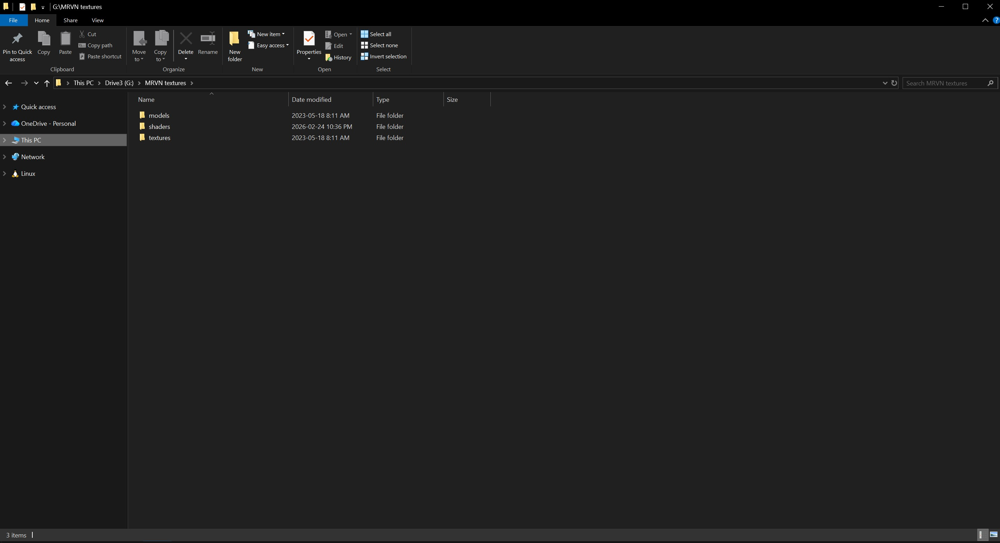

# Shaders

## Introduction
A shader is a script that defines the visual properties of a surface. It is used in MRVN to define the properties of the texture to be compiled into the map and rendered by the engine. An example of a shader property is `$compileflag nodraw` to make the texture not be drawn. A shader definition needs to be present, for a texture, to be able to use a material from a `.rpak`. VMT and VTF don't need a shader definition, but it is good practice to have a shader definition. You can find examples of shader files in [MRVN Resource Pack](https://github.com/MRVN-Radiant/MRVN-Resource-Pack).

---

Shader files are stored in the shaders directory, where the textures for the shaders are stored in the texture directory.



#### Example
A simple shader definition for a texture
```
textures/world/dev/generic_grey
{
    $shadertype LitBumpGeneric
    $surfaceflag litbump
}
```

---